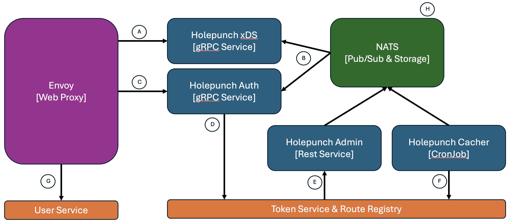

<!-- omit in toc -->
# Contributing to Holepunch

All types of contributions are encouraged and valued. See the
[Table of Contents](#table-of-contents) for different ways to help and details
about how this project handles them. Please make sure to read the relevant
section before making your contribution. It will make it a lot easier for
us maintainers and smooth out the experience for all involved. The
Wormhole community looks forward to your contributions. 🎉

<!-- omit in toc -->
## Table of Contents

- [Architecture](#architecture)
- [Code Structure](#code-structure)
- [I Want To Contribute](#i-want-to-contribute)
- [Reporting Bugs](#reporting-bugs)
- [Code Contributions](#code-contributions)

## Architecture

The core goal for Holepunch is to consolidate details on the desired Wormhole
routes and users (gathered from the Token Service and Route Registry respectively)
and ensure a well-structure and manage gateway can be offered. In this
case our primary gateway service is [Envoy](https://www.envoyproxy.io/) and
though the `holepunch xds` and `holepunch auth` services we are able to
ensure that routing rules stay up to date and all requests have
timely authentication/authorization enforced. In addition to the core
drivers or security and stability, we should strive to ensure that regardless
of the policy requirements at the gateway level all routing decisions remain
well under the `10ms` maximum.



* A: The `holepunch xds` service offers up an API using gRPC, with the
  specifics protobufs defined in the [envoyproxy/go-control-plane](https://github.com/envoyproxy/go-control-plane)
  repository. This service is responsible for the translation of the routes provided
  by the Route Registry to a structure that Envoy can consume along with injecting
  all other policy/security requirements.
* B: A primary purposes of [NATS](nats.io/) is to provide a central pub/sub
  system that all elements of Holepunch can rely upon for distributing the necessary
  context without relying solely on calling the Route Registry or other services. This
  strategy aims at ensure that our primary gateway can continue running or
  quickly recover regardless of the state of any dependant services.
* C: All auth decisions are presented to `holepunch auth`, again using the
  [envoyproxy/go-control-plane](https://github.com/envoyproxy/go-control-plane)
  libraries. The [ext_authz_filte](https://www.envoyproxy.io/docs/envoy/latest/configuration/http/http_filters/ext_authz_filter) allows us to enforce
  authorization on each inbound request without any direct user interaction.
  This also provide additional mechanisms to HTTP request header manipulation
  (i.e., replacing the `Authorization` header before passing it along to the
  upstream service).
* D: When a cache miss occurs `holepunch auth` will communicate directly with the
  Token Service, allowing it to authenticate the users token and provide additional
  context and the appropriate JWT back.
* E: The `holepunch admin` service is a simple restful API providing helper
  function, such as the ability to force a Route Registry update to other
  administrative services part of Wormhole.
* F: The [CronJob](https://kubernetes.io/docs/concepts/workloads/controllers/cron-jobs/), 
  `holepunch cacher`is a central service that maintains up to date information
  in our [NATS](https://nats.io/) instance.
* G: Requests are passed to the desired user service in the majority of cases
  though [Piko](https://github.com/andydunstall/piko). It is for this reason we always
  inject the `X-Piko-Endpoint` header for every requests.
* H: In addition to its core pub/sub support we use [NATS](https://nats.io/)
  as a key/value store. Performance wise options such as Valkey/Redis
  are technically faster (by ~200 microseconds in testing); however,
  the difference is not enough to justify juggling another dependency.

## Code Structure

For the project layout we align for the most part with the public
Golang [project-layout](https://github.com/golang-standards/project-layout)
structure.

| Directory             | Notes                                                                                                               |
|-----------------------|---------------------------------------------------------------------------------------------------------------------|
| `internal/cmds/*`     | Focused on organizing the CLI and loading/initializing elements of Holepunch based upon user provided arguments.    |
| `internal/ctls/*`     | Internal packages and helpers meant to control shared functionality throughout the different Holepunch components.  |
| `internal/envoy`      | Servers and logic supporting the management and interactions with the Envoy web proxy.                              |
| `internal/server`     | Simple web server for administrative actions using the standard Go library.                                         |
| `internal/wormhole/*` | Responsible for managing the interactions with other components of Wormhole (e.g., Token Service & Route Registry). |

## I Want To Contribute

### Reporting Bugs

**Note**: More information is required here; however, for the time being if you run
into issues with any elements of Holepunch or the boarder Wormhole ecosystem
please notify the development team for support.

### Code Contributions

#### Local Development Environment

We advise using [Spack](https://github.com/spack/spack) to manage  all *required*
dependencies for your local development environment in conjunction with
[direnv](https://direnv.net/):

```shell
direnv allow
spack install
```

If this is not possible
please refer to the `spack.yaml` file to identify all software requirements
and their associated versions you will then need to account for these manually.

Additionally, it can be beneficial to install a local container runtime
like [Podman](https://podman.io/) or [Docker](https://www.docker.com/).
This can be used with commands such as `make test-container` or the
development environment `make dev`.

The development environment (source found in
`build/dev`) and provide an easily deployed local environment
to manually test changes:

```shell
$ curl -s -H "X-Token: c520c08c-0325-48c4-8bd1-57bde8c7c382.foo" http://localhost:3128/whoami
{
  "Host": "mock-api:9001",
  "X-Request-Id": "51df78b4-38b8-9494-bd9f-4fdc0fbd13c5",
  ...
}
```

THe mock API endpoints supporting Holepunch, such as the
Token Service and Route Registry, can all be found in
`tools/mock-api`.

#### VSCode Dev Container

Developing locally you may wish to leverage the
[VS Code Dev Container](https://code.visualstudio.com/docs/devcontainers/containers).
Your configuration should look something like:

```json
$ cat .devcontainer/devcontainer.json
{
   "name": "Holepunch Dev Container",
   "image": "docker.io/library/golang::latest",
   "customizations": {
      "vscode": {
         "extensions": [
            "golang.go",
            "GitLab.gitlab-workflow"
         ]
      }
   }
}
```

Replace the `GitLab.gitlab-workflow` with the AI programming tool
of your choice.

## Attribution

This guide is based on the **contributing-gen**.
[Make your own](https://github.com/bttger/contributing-gen)!
